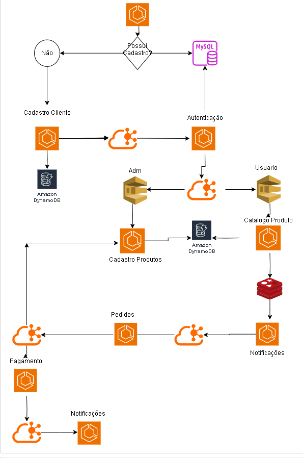

Aqui está um exemplo de `README.md` para o seu projeto:

# Projeto de Microserviços com Arquitetura Hexagonal

## Descrição do Projeto

Este projeto consiste em uma arquitetura de microserviços utilizando Java 17, Spring Boot 3, MongoDB, Kafka, SNS/SQS, Terraform e AWS (Local Stack). A arquitetura hexagonal foi adotada para garantir a separação de responsabilidades e facilitar a manutenção e evolução do sistema.



## Estrutura do Projeto

```plaintext
src/main/java/com/seuprojeto/
├── adapters
│   ├── in
│   │   ├── controller
│   │   ├── dto
│   │   └── exception
│   └── out
│       ├── repository
│       ├── paymentsgateway
│       └── messaging
├── config
│   ├── security
│   ├── cors
│   └── logconfig
├── domain
│   ├── model
│   ├── service
│   └── usecase
├── ports
│   ├── in
│   └── out
├── utils
│   ├── constants
│   └── enums
└── infrastructure
    ├── aws
    ├── kafka
    └── terraform
```

## Microserviços

### Serviço de Autenticação e Autorização
- **Tecnologias**: Java 17, Spring Boot 3, MongoDB, Kafka, SNS/SQS, Terraform
- **Comunicação**: Envia eventos de autenticação via Kafka.
- **Integração**: Outros serviços consomem esses eventos para autenticar usuários.

### Serviço de Cadastro de Produtos
- **Tecnologias**: Java 17, Spring Boot 3, MongoDB, Kafka, SNS/SQS, Terraform
- **Comunicação**: Envia atualizações de produtos via Kafka.
- **Integração**: Serviço de Carrinho de Compras e Serviço de Pedidos consomem essas atualizações.

### Serviço de Cadastro de Clientes
- **Tecnologias**: Java 17, Spring Boot 3, MongoDB, Kafka, SNS/SQS, Terraform
- **Comunicação**: Envia eventos de cadastro de clientes via Kafka.
- **Integração**: Serviço de Autenticação e Autorização consome esses eventos para gerenciar usuários.

### Serviço de Carrinho de Compras
- **Tecnologias**: Java 17, Spring Boot 3, MongoDB, Kafka, SNS/SQS, Terraform
- **Comunicação**: Envia eventos de atualização de carrinho via Kafka.
- **Integração**: Serviço de Pedidos consome esses eventos para criar pedidos.

### Serviço de Pedidos
- **Tecnologias**: Java 17, Spring Boot 3, MongoDB, Kafka, SNS/SQS, Terraform
- **Comunicação**: Envia eventos de criação de pedidos via Kafka.
- **Integração**: Serviço de Pagamentos consome esses eventos para processar pagamentos.

### Serviço de Pagamentos
- **Tecnologias**: Java 17, Spring Boot 3, MongoDB, Kafka, SNS/SQS, Terraform
- **Comunicação**: Envia eventos de pagamento via Kafka.
- **Integração**: Serviço de Pedidos e Serviço de Notificações consomem esses eventos para atualizar o status do pedido e notificar os usuários.

### Serviço de Notificações
- **Tecnologias**: Java 17, Spring Boot 3, MongoDB, Kafka, SNS/SQS, Terraform
- **Comunicação**: Envia notificações aos usuários via Kafka.
- **Integração**: Consome eventos de pedidos e pagamentos para enviar notificações.

## Tecnologias Utilizadas

- **Java 17**: Linguagem de programação principal.
- **Spring Boot 3**: Framework para construção de aplicações Java.
- **MongoDB**: Banco de dados NoSQL.
- **Kafka**: Plataforma de streaming de eventos.
- **SNS/SQS**: Serviços de mensageria da AWS.
- **Terraform**: Ferramenta de infraestrutura como código.
- **AWS (Local Stack)**: Ambiente de desenvolvimento local para serviços AWS.

## Fluxograma de Integrações

```plaintext
+---------------------+       +---------------------+       +---------------------+
| Serviço de Autent.  |       | Serviço de Cadastro |       | Serviço de Cadastro |
| e Autorização       |       | de Produtos         |       | de Clientes         |
|---------------------|       |---------------------|       |---------------------|
| Java 17             |       | Java 17             |       | Java 17             |
| Spring Boot 3       |       | Spring Boot 3       |       | Spring Boot 3       |
| MongoDB             |       | MongoDB             |       | MongoDB             |
| Kafka               |       | Kafka               |       | Kafka               |
| SNS/SQS             |       | SNS/SQS             |       | SNS/SQS             |
| Terraform           |       | Terraform           |       | Terraform           |
+---------------------+       +---------------------+       +---------------------+
         |                           |                           |
         |                           |                           |
         v                           v                           v
+---------------------+       +---------------------+       +---------------------+
| Serviço de Carrinho |       | Serviço de Pedidos  |       | Serviço de Pagamentos|
| de Compras          |       |---------------------|       |---------------------|
|---------------------|       | Java 17             |       | Java 17             |
| Java 17             |       | Spring Boot 3       |       | Spring Boot 3       |
| Spring Boot 3       |       | MongoDB             |       | MongoDB             |
| MongoDB             |       | Kafka               |       | Kafka               |
| Kafka               |       | SNS/SQS             |       | SNS/SQS             |
| SNS/SQS             |       | Terraform           |       | Terraform           |
| Terraform           |       +---------------------+       +---------------------+
+---------------------+               |                           |
         |                            |                           |
         v                            v                           v
+---------------------+       +---------------------+       +---------------------+
| Serviço de Notific. |       | Infraestrutura      |       | AWS (Local Stack)   |
|---------------------|       |---------------------|       |---------------------|
| Java 17             |       | Terraform           |       | Terraform           |
| Spring Boot 3       |       +---------------------+       +---------------------+
| MongoDB             |
| Kafka               |
| SNS/SQS             |
| Terraform           |
+---------------------+
```

## Como Executar o Projeto

1. **Clone o repositório**:
   ```bash
   git clone https://github.com/seuusuario/seuprojeto.git
   cd seuprojeto
   ```

2. **Configure o ambiente**:
    - Certifique-se de ter o Java 17, Maven, Docker e Terraform instalados.

3. **Inicie os serviços AWS localmente**:
   ```bash
   docker-compose up
   ```

4. **Compile e execute os microserviços**:
   ```bash
   mvn clean install
   mvn spring-boot:run
   ```

5. **Acesse a aplicação**:
    - Acesse os endpoints dos microserviços conforme configurado.

## Contribuição

1. Faça um fork do projeto.
2. Crie uma branch para sua feature (`git checkout -b feature/nova-feature`).
3. Commit suas mudanças (`git commit -am 'Adiciona nova feature'`).
4. Faça um push para a branch (`git push origin feature/nova-feature`).
5. Crie um novo Pull Request.

## Licença

Este projeto está licenciado sob a Licença MIT - veja o arquivo [LICENSE](LICENSE) para mais detalhes.
```
